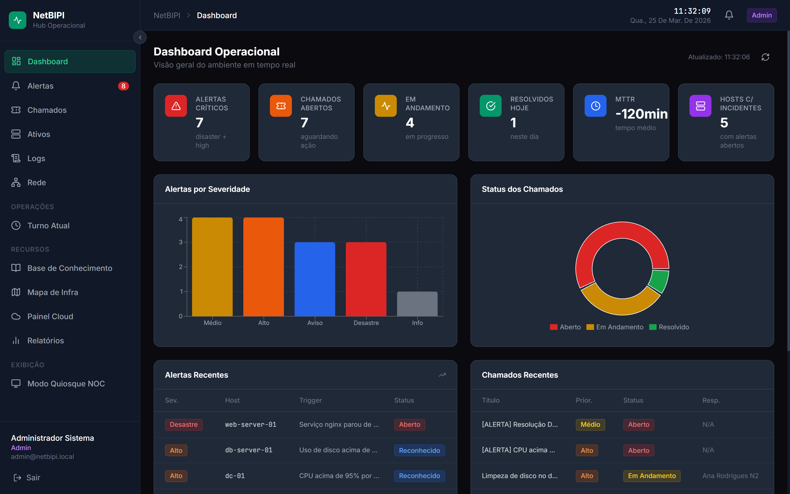
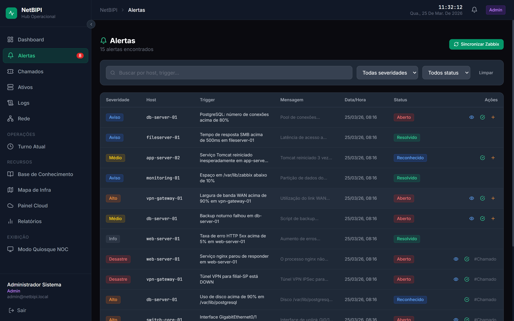
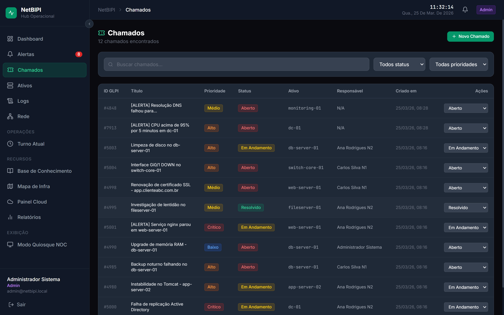
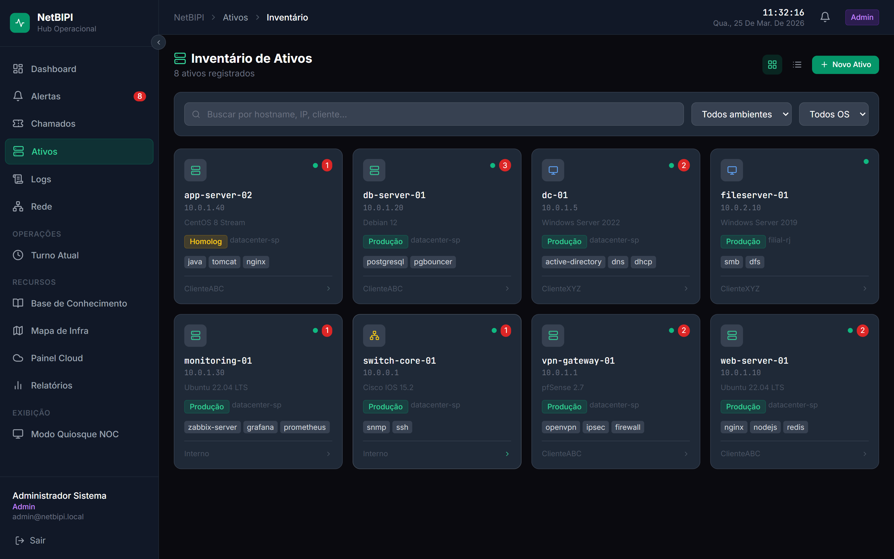
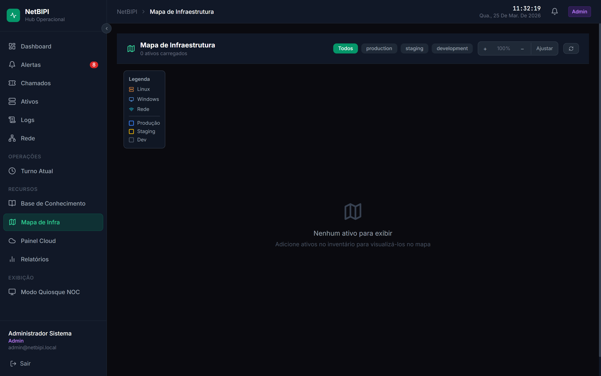
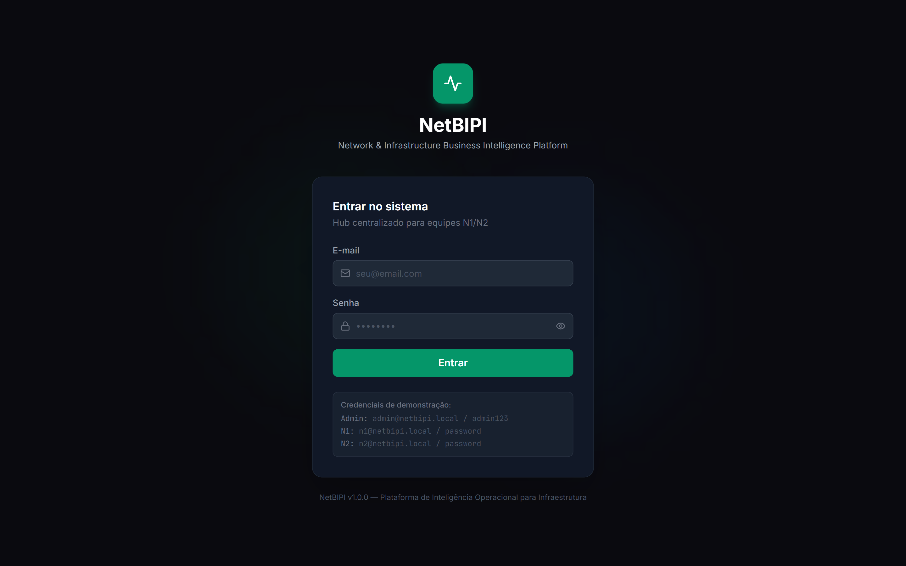
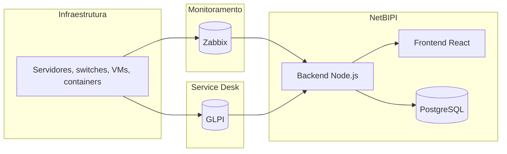

<div align="center">

# NetBIPI
### Network & Infrastructure Business Intelligence Platform

Plataforma open source para centralizar operação N1/N2, monitoramento, service desk e diagnóstico de rede.


</div>

---

## Visão Geral

O NetBIPI foi pensado para equipes que operam entre Zabbix, GLPI, logs, relatórios e diagnósticos de rede ao mesmo tempo.

Em vez de abrir várias ferramentas em paralelo, a plataforma reúne as informações operacionais em um único painel com:

- alertas em tempo real
- integração com service desk
- inventário de ativos
- diagnóstico de rede no navegador
- base de conhecimento para runbooks
- relatórios e histórico operacional

O foco é reduzir troca de abas, acelerar a resposta a incidentes e deixar a operação mais clara para N1, N2 e NOC.

---

## Destaques

- Monitoramento via Zabbix com webhook e sincronização de alertas
- Integração com GLPI para criação e atualização de chamados
- WebSocket para atualização em tempo real sem recarregar a página
- Inventário de ativos com visão visual da infraestrutura
- Painel de cloud opcional em modo de demonstração, relatórios e logs com filtros
- Diagnóstico de rede diretamente no navegador
- Dashboard por turno e fluxo de passagem de plantão
- Modo quiosque para TV de sala de operação
- PWA instalável e auditoria de ações
- CI no GitHub Actions para validar o build do backend e do frontend

---

## Screenshots

As imagens abaixo foram geradas em uma instalação local do projeto.

<table>
  <tr>
    <td></td>
    <td></td>
    <td></td>
  </tr>
  <tr>
    <td></td>
    <td></td>
    <td></td>
  </tr>
</table>

Mais capturas estão em [screenshots/](screenshots/).
Se quiser regenerar a galeria, use `npm run screenshot`.

---

## Stack

| Camada | Tecnologia |
|--------|-----------|
| Frontend | React 18, TypeScript, Tailwind CSS, Vite |
| Backend | Node.js 20, Express, TypeScript |
| Banco de dados | PostgreSQL 16 |
| Tempo real | Socket.io |
| Autenticação | JWT + bcrypt |
| Monitoramento | Zabbix 7.0 |
| ITSM | GLPI REST API |
| Relatórios | PDFKit + ExcelJS |
| Automação | node-cron |
| Containerização | Docker + Docker Compose |

---

## Arquitetura



---

## Como Executar

### Pré-requisitos

- Docker Desktop instalado e em execução
- Git

### Subir o projeto

```bash
git clone https://github.com/diogoviana-commits/netbipi.git
cd netbipi
cp .env.example .env
docker compose up -d
```

No PowerShell, use `Copy-Item .env.example .env`.

Depois de alguns segundos, abra `http://localhost`.

### Acesso inicial

O seed local cria contas de demonstração para ambiente de laboratório.
Antes de publicar o projeto em um ambiente real, ajuste o seed em
`database/init.sql` e as variáveis de ambiente em `.env`.

---

## Perfis Docker

O `docker-compose.yml` usa perfis para ativar integrações opcionais.

```bash
# Somente NetBIPI
docker compose up -d

# NetBIPI + Zabbix
docker compose --profile monitoring up -d

# NetBIPI + GLPI
docker compose --profile itsm up -d

# Tudo
docker compose --profile full up -d
```

| Serviço | URL | Observação |
|---------|-----|-----------|
| NetBIPI | http://localhost | Contas demo no seed local |
| NetBIPI API | http://localhost:3001 | Health check em `/health` |
| Zabbix | http://localhost:8080 | Configure via `scripts/setup-integrations.sh` |
| GLPI | http://localhost:8081 | Tokens gerados no setup |

---

## Configuração das Integrações

Para habilitar as integrações reais:

```bash
bash scripts/setup-integrations.sh
```

Depois, defina:

```env
MOCK_INTEGRATIONS=false
```

Use `MOCK_INTEGRATIONS=true` apenas para laboratório sem Zabbix e GLPI.

Guia completo:

- [INTEGRACAO.md](INTEGRACAO.md)
- [zabbix/setup/configure_zabbix.py](zabbix/setup/configure_zabbix.py)
- [glpi/setup/configure_glpi.sh](glpi/setup/configure_glpi.sh)

### Windows

Se você estiver no Windows, use [netbipi.bat](netbipi.bat) para iniciar perfis, ver status, reiniciar serviços e corrigir credenciais.

---

## Variáveis de Ambiente

Copie [`.env.example`](.env.example) para `.env` e ajuste conforme o ambiente.

| Variável | Descrição | Exemplo |
|----------|-----------|---------|
| `DATABASE_URL` | String de conexão do PostgreSQL | `postgresql://netbipi:...` |
| `POSTGRES_PASSWORD` | Senha usada pelo Postgres e pelo backend | valor do `.env` |
| `JWT_SECRET` | Chave JWT forte | `use-uma-chave-longa` |
| `MOCK_INTEGRATIONS` | Ativa o modo de demonstração local | `true` ou `false` |
| `FRONTEND_URL` | Origem permitida no backend | `http://localhost` |
| `ZABBIX_URL` | URL da API do Zabbix | `http://zabbix-web:8080/api_jsonrpc.php` |
| `ZABBIX_USER` | Usuário da API do Zabbix | `Admin` |
| `ZABBIX_PASSWORD` | Senha da API do Zabbix | `definida no .env` |
| `ZABBIX_WEBHOOK_SECRET` | Secret compartilhado do webhook | valor do `.env` |
| `ZABBIX_DB_NAME` | Banco do Zabbix | `zabbix` |
| `ZABBIX_DB_USER` | Usuário do banco do Zabbix | `zabbix` |
| `ZABBIX_DB_PASSWORD` | Senha do banco do Zabbix | valor do `.env` |
| `ZABBIX_DB_ROOT_PASSWORD` | Senha root do banco do Zabbix | valor do `.env` |
| `GLPI_URL` | URL da API do GLPI | `http://glpi/apirest.php` |
| `GLPI_DB_NAME` | Banco do GLPI | `glpi` |
| `GLPI_DB_USER` | Usuário do banco do GLPI | `glpi` |
| `GLPI_DB_PASSWORD` | Senha do banco do GLPI | valor do `.env` |
| `GLPI_DB_ROOT_PASSWORD` | Senha root do banco do GLPI | valor do `.env` |
| `GLPI_APP_TOKEN` | Token da aplicação GLPI | token da integração |
| `GLPI_USER_TOKEN` | Token do usuário GLPI | token do usuário |

---

## Desenvolvimento Local

### Backend

```bash
cd backend
npm ci
npm run dev
```

### Frontend

```bash
cd frontend
npm ci
npm run dev
```

Por padrão:

- Backend: `http://localhost:3001`
- Frontend: `http://localhost:5173`

---

## API Principal

Rotas principais expostas pelo backend:

```bash
POST   /api/auth/login
GET    /api/alerts
POST   /api/alerts/sync-zabbix
PUT    /api/alerts/:id/acknowledge
GET    /api/tickets
POST   /api/tickets
POST   /api/tickets/from-alert/:id
GET    /api/assets
GET    /api/logs
POST   /api/network/ping
POST   /api/network/dns
POST   /api/network/port
GET    /api/knowledge
GET    /api/reports/pdf
GET    /api/reports/excel
GET    /api/dashboard
GET    /api/shift/summary
GET    /api/cloud/status
POST   /webhooks/zabbix
```

---

## Estrutura do Projeto

```text
netbipi/
├── backend/              API REST + WebSocket
├── frontend/             Interface React
├── database/             Schema e migrações
├── zabbix/               Scripts de integração
├── glpi/                 Automação da API GLPI
├── scripts/              Utilitários e automação
├── screenshots/          Capturas para o README e LinkedIn
├── docker-compose.yml    Orquestração dos serviços
├── INTEGRACAO.md         Guia de setup das integrações
├── LINKEDIN.md           Texto pronto para divulgar o projeto
└── netbipi.bat           Menu de inicialização para Windows
```

---

## Roadmap

- [x] Dashboard operacional com métricas em tempo real
- [x] Integração Zabbix via API e webhook
- [x] Integração GLPI via REST API
- [x] Inventário de ativos com mapa visual
- [x] Diagnóstico de rede no navegador
- [x] Base de conhecimento com runbooks
- [x] Relatórios PDF e Excel
- [x] Modo quiosque NOC
- [x] PWA instalável
- [x] Escalada automática de incidentes
- [x] Dashboard por turno e passagem de plantão
- [ ] Alertas por WhatsApp ou Telegram
- [ ] Envio de e-mail automático para alertas críticos
- [ ] Execução remota de scripts
- [ ] Janelas de manutenção programada
- [ ] Autenticação via Active Directory
- [ ] Multi-tenant
- [ ] Análise de tendência e predição de falhas

---

## Lançamento

Material pronto para o primeiro release público:

- [CHANGELOG.md](CHANGELOG.md)
- [RELEASE.md](RELEASE.md)
- [LINKEDIN.md](LINKEDIN.md)

---

## Divulgação

Quer anunciar o projeto?

- Use [RELEASE.md](RELEASE.md) como base para o GitHub Release
- Use [LINKEDIN.md](LINKEDIN.md) como base para o post do LinkedIn
- Use as imagens da pasta [screenshots/](screenshots/) para montar o carrossel
- Destaque a combinação de monitoramento, service desk e open source

---

## Comunidade

- Leia [CONTRIBUTING.md](CONTRIBUTING.md) antes de abrir um PR
- Consulte [CODE_OF_CONDUCT.md](CODE_OF_CONDUCT.md) para o comportamento esperado na comunidade
- Use as issue templates em [.github/ISSUE_TEMPLATE/](.github/ISSUE_TEMPLATE/)
- A política de segurança está em [SECURITY.md](SECURITY.md)
- Dependências são acompanhadas por Dependabot em [.github/dependabot.yml](.github/dependabot.yml)

---

## Licença

Distribuído sob a licença MIT. Veja [LICENSE](LICENSE).

---

<div align="center">
Feito para equipes de suporte, infraestrutura e operações que precisam de visão única do ambiente.
</div>
